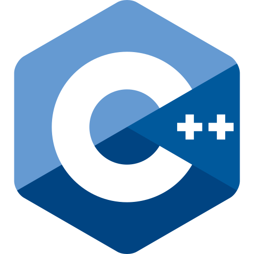



<!-- WORK EXPERIENCE -->
## Work experience:

**Postdoctoral Researcher**
  - University of Amsterdam, 
  - Mar 2025 - Now
  - Investigating the Blume-Capel model to capture opinion dynamics. 
    Collaboration with Prof. Dr. Han van der Maas.
  

**Postdoctoral Researcher**
  - University of Amsterdam, 
  - Oct 2023 - Feb 2025
  - Validating and providing software for the simulation of the Minds For Mobile Agents agent-based pedestrian model.
    Collaboration with Prof. Dr. Andrew Heathcote, Dr. Dora Matzke, Dr. Tessa Blanken, and Prof. Dr. Denny Borsboom.
  

**PhD Student**
  - KU Leuven,  
  - Sep 2019 - Sep 2023
  - Validating the Affective Ising Model (AIM), a drift-diffusion model aimed at capturing affect dynamics.
    Supervised by Prof. Dr. Francis Tuerlinckx (main supervisor), Prof. Dr. Wolf Vanpaemel, and Prof. Dr. Agnes Moors (co-supervisors).
  

**Tutor in Statistics**
  - Rebus, 
  - Jan 2018 - Sep 2019
  - Teaching basic and advanced principles of statistics based on both the required course material and my own.

<!-- EDUCATION -->
## Education:

**Master of Science in Psychology**
  - KU Leuven,  
  - Sep 2014 - Sep 2019
  - Specialization _Theory and Research_

<!-- TEACHING -->
## Teaching:

**Tutor**
  - University of Amsterdam, 
  - Feb 2025 - Now
  - Tutor of the _Basic Skills in Programming, Statistics, and Mathematics_ course, focusing on the Programming part.
    Also helped students use <a href="https://www.github.com/ndpvh/predped">predped</a> to simulate data with the Minds for Mobile Agents pedestrian model as part of a _Digital Twinning_ course.
  

**Supervision of Students**
  - University of Amsterdam, 
  - Oct 2023 - Now
  - Main supervision of 2 interns, 2 master thesis students, and 6 bachelor thesis students.
    Topics were mostly focused on testing the validity of the Minds for Mobile Agents model.
  

**Co-supervision of Students**
  - KU Leuven,  
  - Sep 2019 - Sep 2023
  - Co-supervision of 2 student interns and 13 students who needed to complete their master thesis.
    Topics ranged from psychometrics to machine learning and model fitting to preregistered replications of previously published studies.
    Main supervision was taken up by Prof. Dr. Francis Tuerlinckx or Prof. Dr. Wolf Vanpaemel.
  

**Tutor of Practicals in Social Psychology**
  - KU Leuven,  
  - Sep 2019 - Sep 2022
  - Teaching students the basic principles of research through practice. 
    Students were taught to critically analyze the main goals, research methods, and results of a selection of papers in the field of social psychology.
    Taught under supervision of Prof. Dr. Vera Hoorens.
  

**Tutor in Statistics**
  - Rebus, 
  - Jan 2018 - Sep 2019
  - Teaching basic and advanced principles of statistics based on both the required course material and my own.

<!-- SKILLS -->
## Skills:

**Data Science** \\
I am able to conduct complicated analyses and interpret the results in a comphrensive yet nuanced manner.
My philosophy to analysis is using the right tools for the job. 
This has led me to using a variety of estimation methods (e.g., estimation in a frequentist and Bayesian way) and a variety of different statistical models that range in complexity, going from ANOVAs and linear regressions to complex systems like the Ising model.

**Programming languages**

 \\
Used as a general tool for data science, including the manipulation and analysis of data.
Most of my work relies on R for simulation, estimation, and visualization.

 \\
Used as a general tool for data science, mostly focusing on the analysis of data.
Although still a big fan of Julia, I primarily used this programming language during my PhD.

 \\
Primarily used to create experiments or as a general purpose tool.

 \\
Used to create online experiments through the <a href="https://lab.js.org/">lab.js</a> study builder.
Using this module, I created a flexible framework for conducting the experiments that formed the basis of my PhD (<a href="https://gitlab.kuleuven.be/ppw-okpiv/researchers/u0123135/probabilistic-reward-task">click here</a> to see this project).

 \\
Used as a data science tool at the beginning of my PhD, but later switched to Julia to benefit of the latter's efficiency.

 \\
Just starting out in using C++ on a basic level through the <a href="https://www.rcpp.org/">Rcpp</a> package.

<!-- PUBLICATIONS -->
## Selected publications

> **Vanhasbroeck, N.**, Loossens, T., & Tuerlinckx, F. (2024). Two peas in a pod: Discounting models as a special case of the VARMAX. _Journal of Mathematical Psychology_, Article 102856. doi: <a href="https://www.doi.org/10.1016/j.jmp.2024.102856">10.1016/j.jmp.2024.102856</a>

A proof establishing a connection between two different types of models that have been used to investigate affect dynamics, namely the autoregressive models and the discounting models.

> **Vanhasbroeck, N.**, Vanbelle, S., Moors, A., Vanpaemel, W., & Tuerlinckx, F. (2024). Chasing consistency: On the measurement error in self-reported affect in experiments. _Behavior Research Methods, 56_(4), 3009-3022. doi: <a href="https://www.doi.org/10.3758/s13428-023-02290-3">10.3758/s13428-023-02290-3</a>

A first exploration of measurement and whether it influences the conclusions we draw from our (time-series) data.

> **Vanhasbroeck, N.**, Ariens, S., Tuerlinckx, F., & Loossens, T. (2021). Computational models for affect dynamics. In: C.H. Waugh, P. Kuppens (Eds.), _Affect Dynamics, (213-260)_. Cham: Springer. doi: <a href="https://www.doi.org/10.1007/978-3-030-82965-0\_10">10.1007/978-3-030-82965-0\_10</a>

A review of computational models that have been used to investigate how affect changes over time.
